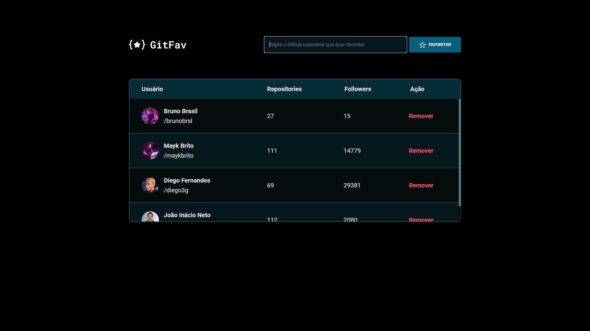

# GitFav

Desafio "GitFav" do Explorer Rocketseat - Stage 06

## 🚀 Tecnologias

Esse projeto foi desenvolvido com as seguintes tecnologias:

- HTML e CSS
- JavaScript

## 💻 Projeto

Página web com conexão API, na qual são feitas requisições para adição de perfis favoritos do Github. 

- [Acesse o projeto finalizado, online](https://brunobrsl.github.io/gitfav)

## 🔗 Links

